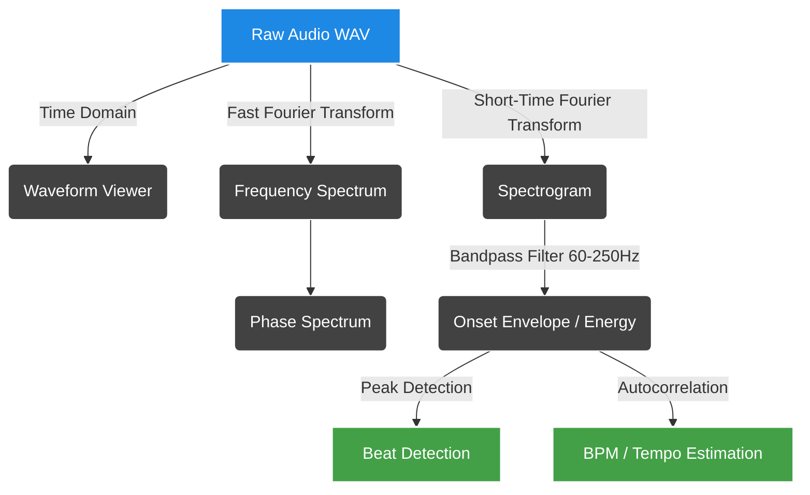

<div align="center">
  <h1>🎵 Fourier Beat Analyzer<br><sub>Tamil Music Edition</sub></h1>
  <p><i>A full-stack, real-time signal processing engine that decodes the complex rhythms of Tamil music using raw mathematics.</i></p>

  <!-- Badges -->
  <p>
    
    
    
    
    
  </p>
</div>

---

## 🌟 Overview

The **Fourier Beat Analyzer** is an educational yet powerful tool built to visualize and understand the magic behind beat detection. Designed specifically with the percussive complexities of Indian music (like the Mridangam and intricate Talas) in mind, this tool implements the entire digital signal processing (DSP) pipeline from scratch—no `librosa` magic, just raw `numpy` and `scipy` math!

It breaks down audio signals from the time domain all the way to tempo estimation, offering a rich interactive dashboard to visualize every mathematical transformation.

---

## ✨ Features

- **End-to-End DSP Pipeline**: From raw waveforms to BPM extraction.
- **Zero "Magic Box" Dependencies**: Pure mathematical implementation of FFT, STFT, and Autocorrelation.
- **Interactive Visualizations**: Beautiful, real-time graphs using Chart.js.
- **Tailored for Complex Rhythms**: Specially tuned bandpass filters to isolate deep bass and percussive hits typical in Tamil tracks.
- **Comprehensive API**: A clean REST backend that serves fully processed frequency and time-domain data.

---

## 🔬 The Signal Processing Pipeline



### 1. Time Domain (Waveform)
The raw audio signal `x[n]`: amplitude vs time. This is the foundation of our analysis.

### 2. Discrete Fourier Transform (FFT)
Decomposes the signal into frequency components using `numpy.fft.rfft` (O(N log N)). A Hann window is applied to reduce spectral leakage, outputting magnitude `|X[k]|` and phase `φ[k]`.

### 3. Phase Spectrum
```math
φ[k] = \arctan\left(\frac{\text{Im}\{X[k]\}}{\text{Re}\{X[k]\}}\right)
```
Phase differences between STFT frames help detect transients and structural changes in the audio.

### 4. Short-Time Fourier Transform (Spectrogram)
We slide a 2048-sample Hann window with a 512-sample hop across the audio, running an FFT on each frame. This generates a frequency × time matrix visualized as a heatmap.

### 5. Onset Envelope (Beat Detector)
By filtering the audio to isolate bass frequencies (60–250 Hz, where kick drums and mridangams reside), we measure energy increases between frames. Peaks in this energy curve represent beats.

### 6. Autocorrelation (Tempo Estimation)
We use autocorrelation via FFT to find repeating patterns in the onset envelope. Strong correlation peaks indicate the dominant rhythmic period, which we convert to Beats Per Minute (BPM).

---

## 🚀 Getting Started

### Prerequisites
- Python 3.8+
- Modern Web Browser (Chrome/Firefox/Safari)

### 1. Start the Backend Server
Navigate to the `backend` directory and run the Flask app:
```bash
cd backend
pip install -r requirements.txt  # Or install manually: pip install flask numpy scipy
python app.py
```
> **Note:** The server runs on `http://localhost:5050`.

### 2. Launch the Frontend Dashboard
You can simply double-click `frontend/index.html` to open it in your browser, or serve it locally:
```bash
python -m http.server 8080 --directory frontend
```
> Go to `http://localhost:8080` to view the dashboard.

### 3. Analyze Your Music
Convert your favorite Music track to WAV format (using FFmpeg or Audacity), upload it through the dashboard, and watch the math unfold!
```bash
# Example conversion using FFmpeg
ffmpeg -i your_song.mp3 your_song.wav
```

---

## 📡 API Reference

The backend exposes a single, powerful endpoint for full analysis:

### `POST /analyze`
- **Request:** `multipart/form-data` containing the `audio` field (WAV file).
- **Response:** A comprehensive JSON object containing all computed arrays.

<details>
<summary><b>Click to view JSON Response Schema</b></summary>

```json
{
  "meta": {
    "sample_rate": 44100,
    "duration": 180.5,
    "bpm": 120.4,
    "n_beats": 360,
    "n_samples": 7959950
  },
  "waveform": { "times": [...], "amplitudes": [...] },
  "fft": { "freqs": [...], "magnitudes": [...] },
  "phase": { "freqs": [...], "values": [...] },
  "spectrogram": { "times": [...], "freqs": [...], "magnitudes": [[...]] },
  "onset": { "times": [...], "envelope": [...], "beat_times": [...], "threshold": 0.5 },
  "autocorrelation": { "bpm_axis": [...], "values": [...] }
}
```
</details>


<div align="center">
  <p>Built with ❤️ and Math.</p>
</div>
